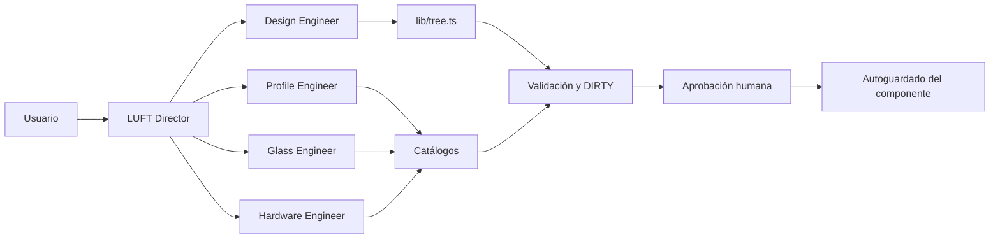

# LUFT AI · Fase 1

## Principio operativo

> La IA interpreta. Los motores deterministas calculan. La base de datos confirma. El humano aprueba.

LUFT AI no modifica un componente durante la interpretación. Cada agente devuelve hallazgos o una
`AgentChange` con ruta, valor anterior, valor propuesto, dependencias, fuentes y confianza. Solo el
flujo de aprobación puede enviar esa propuesta a `applyApprovedChanges()`, que rechaza propuestas
obsoletas y aplica únicamente rutas conocidas.

## Agentes implementados

- **LUFT Director:** permisos, alcance, delegación y consolidación.
- **Design Engineer:** dimensiones, árbol, proporciones, tipologías y límites de referencia.
- **Profile Engineer:** sistema, familias y códigos presentes en el catálogo real.
- **Glass Engineer:** partida de vidrio y compatibilidad de espesor/galce.
- **Hardware Engineer:** detecta ausencias e inconsistencias; bloquea recomendaciones porque aún no
  existe un catálogo verificable de herrajes.



## Intenciones locales admitidas

El intérprete de Fase 1 es deliberadamente acotado. Reconoce:

- revisar o validar el componente;
- cambiar ancho, alto o cantidad;
- seleccionar un sistema por nombre exacto;
- seleccionar un vidrio por nombre completo;
- cambiar la tipología de la hoja seleccionada;
- seleccionar un código de perfil confirmado para marco u hoja.

Ante una intención ambigua solicita un dato concreto. No se presenta como LLM y no completa valores
por semejanza.

## Confianza y procedencia

Los estados son `high`, `medium`, `low` y `blocked`. Las evidencias distinguen motor determinista,
catálogo verificado, dato del proyecto, medición de campo, estimación y fuente faltante. Un cambio con
confianza `blocked` no puede aprobarse.

Los datos ya marcados como estimados en `data/catalog.ts` conservan esa condición. El catálogo de
vidrio se considera confianza media porque no trae proveedor/revisión por partida. Los herrajes se
consideran no verificables hasta cargar SKUs, capacidades, fichas y revisiones.

## Dependencias DIRTY

Cambiar una dimensión, sistema, vidrio, cantidad, marco u hoja invalida solo sus consumidores
declarados: diseño, cortes de perfil, dimensiones de vidrio, cargas/configuración de herraje,
cotización y/o producción. La aplicación del cambio no borra el estado DIRTY; una nueva revisión debe
validar el resultado.

## Persistencia

`ComponentData.luftAi` conserva revisión, propuestas, estado por campo y las últimas 100 entradas de
auditoría. Es opcional para abrir sin migración todos los componentes anteriores. La estructura
principal sigue normalizada como `projects` y `components`; los cálculos existentes ignoran el estado
de agentes.

La siguiente migración de datos debe normalizar:

- `project_members`
- `agent_runs`
- `agent_changes`
- `field_states`
- `approvals`
- `audit_events`

La serialización actual permite validar el flujo antes de fijar ese esquema y sus políticas de
retención.

## Acceso

En producción, iniciar sesión no concede automáticamente permisos técnicos. Los correos se autorizan
del lado servidor mediante listas separadas por coma:

```text
LUFT_OWNER_USERS=propietario@empresa.com
LUFT_TECHNICAL_USERS=tecnico1@empresa.com,tecnico2@empresa.com
```

Los demás usuarios reciben rol `viewer`. En desarrollo existe una sesión técnica local para facilitar
las pruebas. Este RBAC protege la capa nueva de agentes; las rutas antiguas `/api/projects` siguen
requiriendo una fase posterior de autenticación, propiedad y validación de payloads.

## Verificación

```bash
npm run test:agents
```

Las pruebas cubren evidencia sin invención, aplicación aislada, propagación DIRTY, rechazo de
propuestas obsoletas, modificación de una sola hoja y permisos de viewer. El build completo debe pasar
además con `vinext build`.
